# My Rock Paper Scissors Game

This is my third project for Code Institute. This game is a Python terminal game.
Rock Paper Scissors is a game where the user will go up against the computer to beat them.
Ways of winning are:
Rock beats Paper
Paper beats Scissors
Scissors beats Rock

[Live project](https://pro3-rock-paper-scissors-c05fcd7fb8f7.herokuapp.com/)

## Index

* [User Experience](#user-experience-ux)
* [Flow chart](#flow-chart)
* [Features](#features)
* [Technologies Used](#technologies-used)
* [Testing](#testing)
* [Deployment](#deployment)
* [Credits](#credits)

## User Experience (UX)

[Am I Responsive](images/am-i-responsive.jpg)

### User Stories

- As a User, I would want to be able to:
1. Understand the rules of the game
2. Navigate around the game easily.
3. See the options I have to chose from when deciding.
4. Know who the winner is or if it is a tie.
5. Know when the game ends.
6. Replay the game if I want to or be able.

## Flow chart

- This flow chart explains the logic of Rock Paper Scissors.

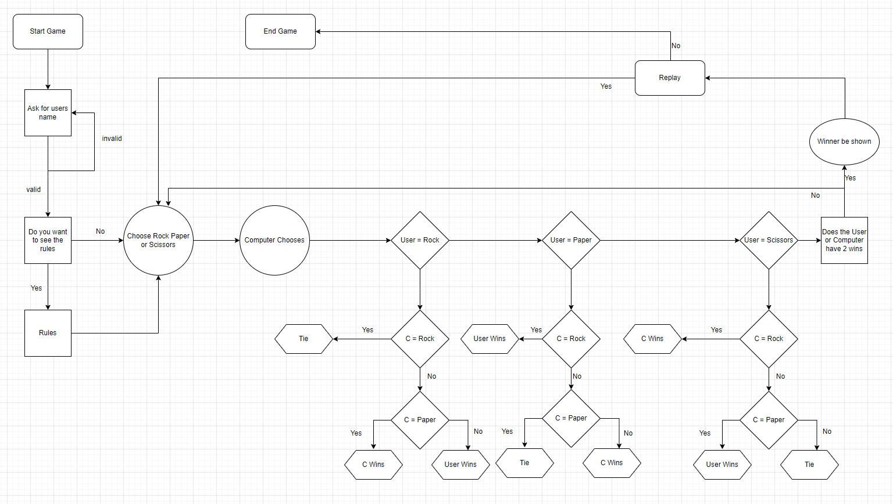

## Features

### Existing Features

#### 1. Welcome message
- This displays a message welcoming the user.
- It will ask the user to input their name.

#### 2. Invalid name input
- This will happen if there is something other than letters.

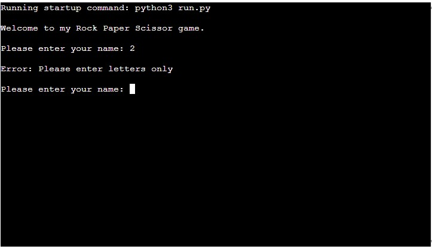

#### 3. Invalid input to see the rules
- This will happen if the user does not put the right input.
- (y) is for yes and will show the rules.
- (n) is for no and will go straight into the game.

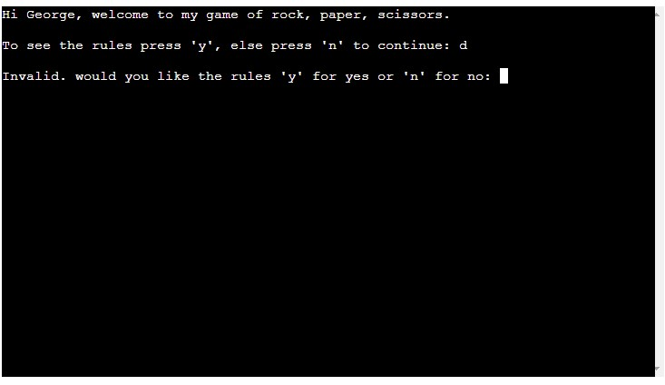

#### 4. Showing the rules
- If the user chooses to see the rules they will then be displayed for them.

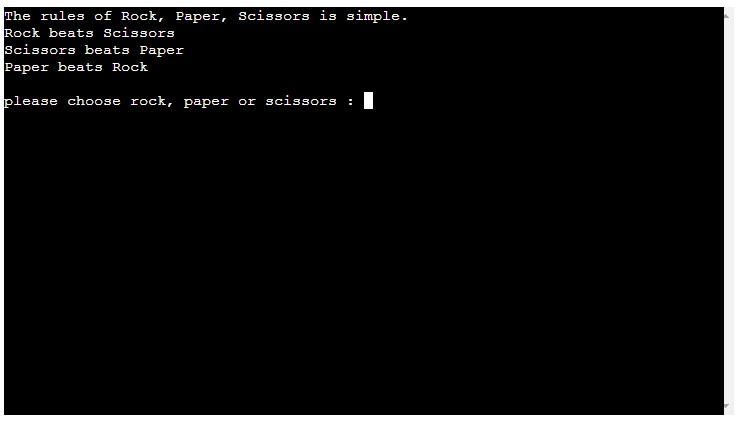

#### 5. Going into the game
- If the user chooses not to see the rules then it will enter the game.

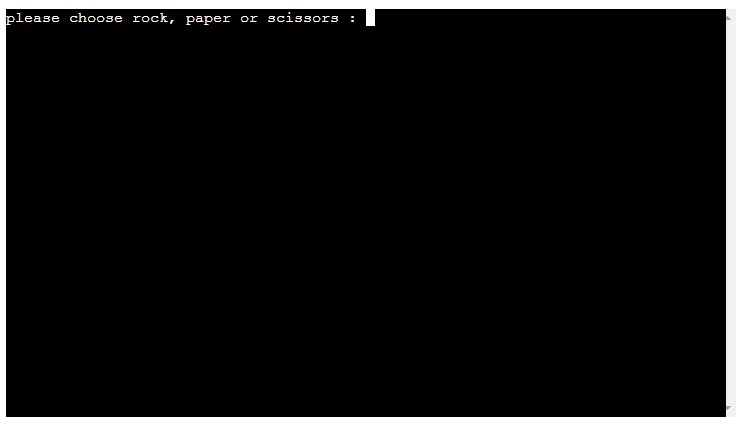

#### 6. Invalid input when playing the game
- If the user does not pick out of the options it will show an error.
- The user has to pick between Rock Paper or Scissors.

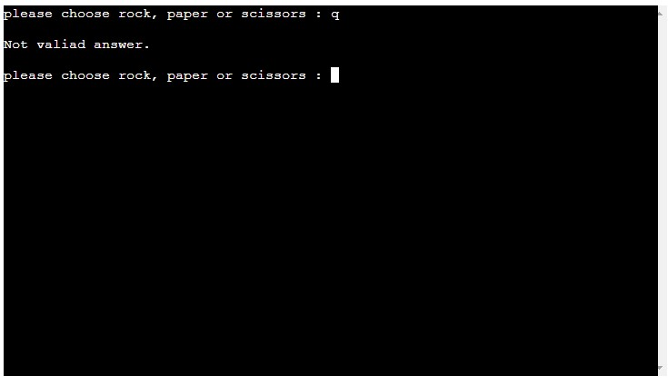

#### 7. Finding out who wins
- If the User wins it will print You Win.
- If the computer wins it will print Computer wins.
- If both the user and computer choose the same option then it will be a tie.

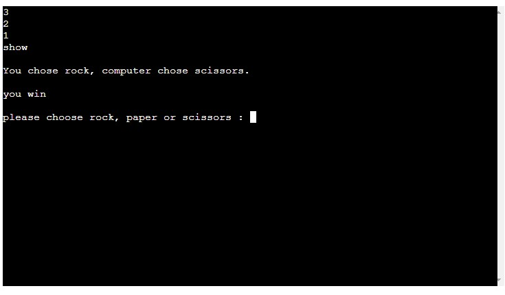

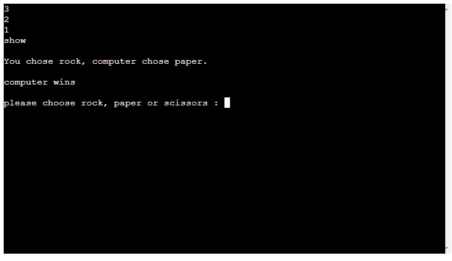

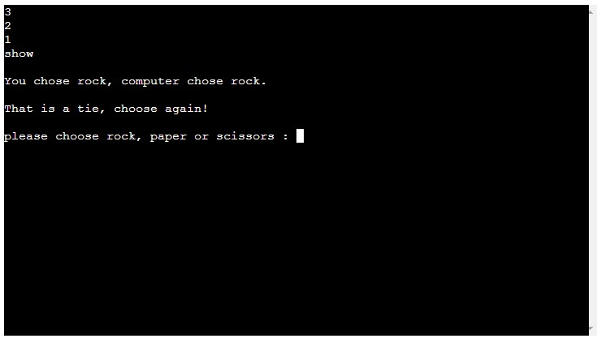

#### 8. Game Over
- The game will end when either the computer or user gets 2 wins.

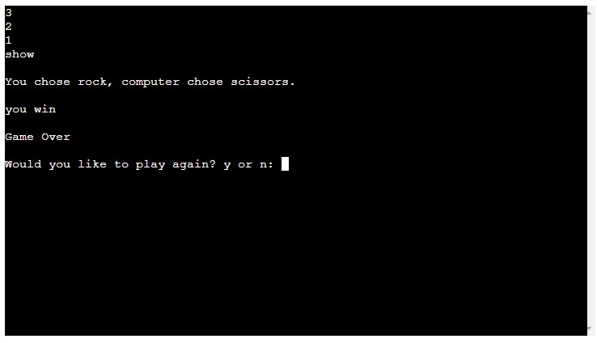

#### 9. Invalid input to restart the game
- A message will show to ask if the user would like to restart the game or exit.
- (y) is for yes and will restart the game asking the user to choose between the options.
- (n) is for no and will end the game.

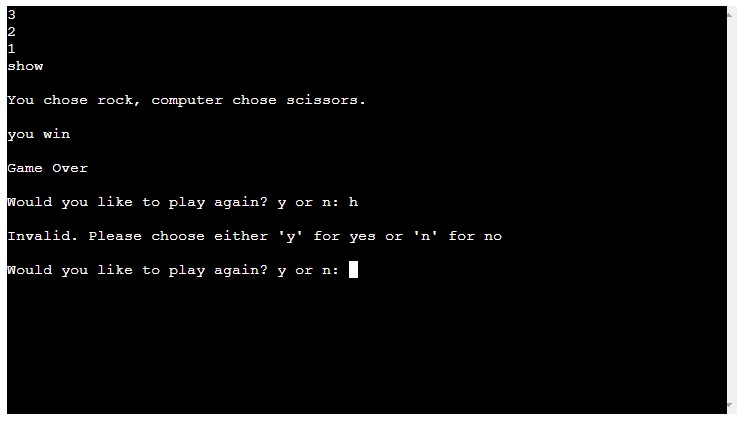

#### 10. End Game
- This is a message telling the user that the game is over and they chose to exit.

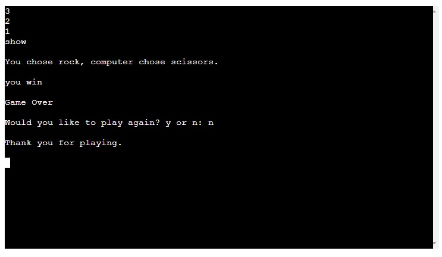

### Features to be added

- Adding a difficulty level
- Add Lizard Spock into the game. Adding this would make it a medium difficulty game as there is more options to choose and more ways of losing.

## Technologies Used

- Python
- [Am I responsive](https://amiresponsive.co.uk/)
- [Flow chart](https://draw.io)
- [GitHub](https://github.com/)
- [Heroku](https://dashboard.heroku.com/)

## Testing

## Deployment

This project was deployed to Heroku using the Code Institutes mock terminal. This was provided by Code Institutes python-template.

The steps to deploy this project was:
    - Create a new Heroku app
    - Go to the settings and click Reveal Config Var
    - In the Key box put PORT
    - In the Value box put 8000
    - Then underneath Add buildpack and choose Python and NodeJS in this order.
    - Now go to the top and click on the Deploy tab.
    - Here link GitHub and add the repository.
    - Scroll down and Enable automatic deployment from main
    - Under that click Deploy.

## Credits

My Mentor Brian Macharia for helping me and guiding me throughout the project.

I used this link to know about the timer that was imported
 - https://realpython.com/python-sleep/
I used this link to understand the game Rock Paper Scissors.
    - https://realpython.com/python-rock-paper-scissors/