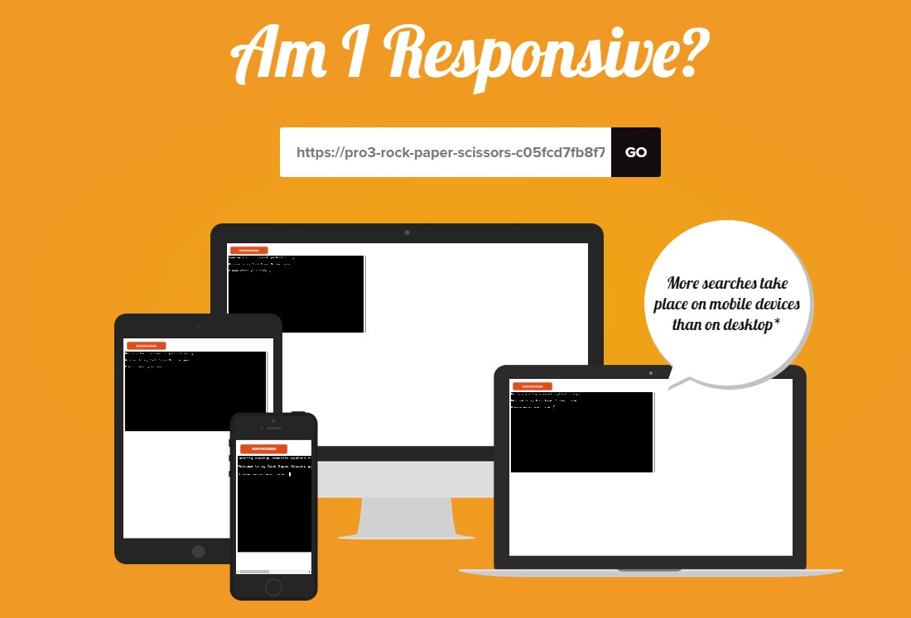
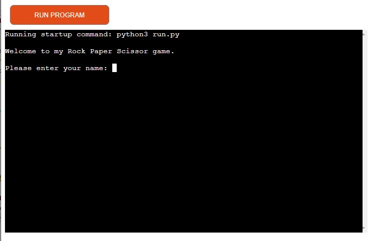

# My Rock Paper Scissors Game

This is my third project for Code Institute. This game is a Python terminal game.
Rock Paper Scissors is a game where the user will go up against the computer to beat them.
Ways of winning are:
Rock beats Paper
Paper beats Scissors
Scissors beats Rock

[Live project](https://pro3-rock-paper-scissors-c05fcd7fb8f7.herokuapp.com/)

## Index

* [User Experience](#user-experience-ux)
* [Flow chart](#flow-chart)
* [Features](#features)
* [Technologies Used](#technologies-used)
* [Testing](#testing)
* [Deployment](#deployment)
* [Credits](#credits)

## User Experience (UX)

### User Stories

- As a User, I would want to be able to:
1. Understand the rules of the game
2. Navigate around the game easily.
3. See the options I have to chose from when deciding.
4. Know who the winner is or if it is a tie.
5. Know when the game ends.
6. Replay the game if I want to or be able.

## Flow chart

- This flow chart explains the logic of Rock Paper Scissors.

## Features

### Existing Features

#### 1. Welcome message
- This displays a message welcoming the user.
- It will ask the user to input their name.

#### 2. Invalid name input
- This will happen if there is something other than letters.

#### 3. Invalid input to see the rules
- This will happen if the user does not put the right input.
- (y) is for yes and will show the rules.
- (n) is for no and will go straight into the game.

#### 4. Showing the rules
- If the user chooses to see the rules they will then be displayed for them.

#### 5. Going into the game
- If the user chooses not to see the rules then it will enter the game.

#### 6. Invalid input when playing the game
- If the user does not pick out of the options it will show an error.
- The user has to pick between Rock Paper or Scissors.

#### 7. Finding out who wins
- If the User wins it will print You Win.
- If the computer wins it will print Computer wins.
- If both the user and computer choose the same option then it will be a tie.

#### 8. Game Over
- The game will end when either the computer or user gets 2 wins.

#### 9. Invalid input to restart the game
- A message will show to ask if the user would like to restart the game or exit.
- (y) is for yes and will restart the game asking the user to choose between the options.
- (n) is for no and will end the game.

#### 10. End Game
- This is a message telling the user that the game is over and they chose to exit.

### Features to be added

- Add r, p and s to make it simpler for user to choose instead of writing the word out.
- Adding a difficulty level.
- Add Lizard Spock into the game. Adding this would make it a medium difficulty game as there is more options to choose and more ways of losing.

## Technologies Used

- Python
- [Am I responsive](https://amiresponsive.co.uk/)
- [Flow chart](https://draw.io)
- [GitHub](https://github.com/)
- [Heroku](https://dashboard.heroku.com/)

## Testing

| Test Label                                                                                        | Test Action                                                              | Expected Outcome                                                                                                 | Pass/Fail |
| ------------------------------------------------------------------------------------------------- | ------------------------------------------------------------------------ | ---------------------------------------------------------------------------------------------------------------- | --------- |
| Game starts correctly                                                                             | Navigate to the game                                                     | Welcome screen is show on terminal. Game asks the user for their name.                                           | PASS      |
| Username validation                                                                               | Input letters only                                                       | Input is accepted, game greets user and moves to the next screen.                                                | PASS      |
| Username validation                                                                               | Input anything including non-roman letter characters                     | Input is rejected, with a message to the user to that effect. User is given another chance to enter their name.  | PASS      |
| Rules screen user option validation (correct option)                                              | Input y or n                                                             | Input is accepted, game will print the instructions to the game on the next screen.                              | PASS      |
| Rules screen user option validation (case agnostic)                                               | Input Y or N                                                             | Input is accepted, with the .lower() method.                                                                     | PASS      |
| Rules screen user option validation (leading/trailing space agnostic)                             | Input y, Y, n, or N with leading or trailing spaces                      | Input is accepted, with the .strip() method.                                                                     | PASS      |
| Rules screen user option validation (incorrect option)                                            | Input anything that is not y, Y, N, n                                    | Input is rejected, with a message to the user giving them another go at entering the right letter.               | PASS      |
| Choosing out of the options validation (Rock, Paper or Scissors)(correct option)                  | Input rock, paper or scissors                                            | Input is accepted, game will then get the computer to randomly choose.                                           | PASS      |
| Choosing out of the options validation (Rock, Paper or Scissors)(case agnostic)                   | Input Rock, Paper or Scissors                                            | Input is accepted, game will then get the computer to randomly choose.                                           | PASS      |
| Choosing out of the options validation (Rock, Paper or Scissors)(leading/trailing space agnostic) | Input all lowercase, all uppercase or mix throughout the option          | Input is accepted, game will then get the computer to randomly choose.                                           | PASS      |
| Choosing out of the options validation (Rock, Paper or Scissors)(incorrect option)                | Input anything other than the words rock, paper or scissors.             | Input is rejected, with a message to the user letting them put the right input in                                | PASS      |
| Choosing Rock when the computer has chosen Rock                                                   | Input Rock and computer chooses Rock                                     | The game will have a message telling the user that, them and the computer chose the same option and to go again. | PASS      |
| Choosing Rock when the computer has chosen Paper                                                  | Input Rock and computer chooses Paper                                    | The game will have a message telling the user if they won or if the computer beat him.                           | PASS      |
| Choosing Rock when the computer has chosen Scissors                                               | Input Rock and computer chooses Scissors                                 | The game will have a message telling the user if they won or if the computer beat him.                           | PASS      |
| Choosing Paper when the computer has chosen Rock                                                  | Input Paper and computer chooses Rock                                    | The game will have a message telling the user if they won or if the computer beat him.                           | PASS      |
| Choosing Paper when the computer has chosen Paper                                                 | Input Paper and computer chooses Paper                                   | The game will have a message telling the user that, them and the computer chose the same option and to go again. | PASS      |
| Choosing Paper when the computer has chosen Scissors                                              | Input Paper and computer chooses Scissors                                | The game will have a message telling the user if they won or if the computer beat him.                           | PASS      |
| Choosing Scissors when the computer has chosen Rock                                               | Input Scissors and computer chooses Rock                                 | The game will have a message telling the user if they won or if the computer beat him.                           | PASS      |
| Choosing Scissors when the computer has chosen Paper                                              | Input Scissors and computer chooses Paper                                | The game will have a message telling the user if they won or if the computer beat him.                           | PASS      |
| Choosing Scissors when the computer has chosen Scissors                                           | Input Scissors and computer chooses Scissors                             | The game will have a message telling the user that, them and the computer chose the same option and to go again. | PASS      |
| Determine if there is a winner (There is a winner)                                                | After every round, check to see if the user or the computer has 2 points | A message will show telling the user that there is a winner and that whoever one the latest round is the winner  | PASS      |
| Determine if there is a winner (There is not a winner)                                            | After every round, check to see if the user or the computer has 2 points | The game will go to the next round and will keep asking for inputs until there is a winner with 2 points         | PASS      |
| Asking to play again (replaying the game)                                                         | Input Y or y                                                             | The game will reset and ask the user to choose out of the options                                                | PASS      |
| Asking to play again (incorrect option)                                                           | Input a letter not valid                                                 | A message will show telling the user that, they need to input a valid letter                                     | PASS      |
| Asking to play again (end the game)                                                               | Input N or n                                                             | The game will end and the terminal will stop                                                                     | PASS      |

### Validator Testing
I used https://www.pythonchecker.com/ to validate my Python code.
The code passed with no errors raised.

### Browser
- Google Chrome
- Microsoft Edge
- Microsoft Internet Explorer
- Mozilla FireFox
- Safari

### Bugs

There is no current bugs and everything is working correctly.

#### Solved Bugs
- If there was a tie in the game. I had a while loop that would keep looping because the user and computer had already chosen there option.
    - I resolved this by adding a break at the end of the loop. This would then mean nobody gets a point and the user would have to input again.
- With the resolved issue above. I then had to add a while loop in the start game function so that the game will continue until the if statement is true.
    - The if statement was if the user or computer had 2 points then end the game.

## Deployment

This project was deployed to Heroku using the Code Institutes mock terminal. This was provided by Code Institutes python-template.

- The steps to deploy this project was:
    - Create a new Heroku app
    - Go to the settings and click Reveal Config Var
    - In the Key box put PORT
    - In the Value box put 8000
    - Then underneath Add buildpack and choose Python and NodeJS in this order.
    - Now go to the top and click on the Deploy tab.
    - Here link GitHub and add the repository.
    - Scroll down and Enable automatic deployment from main
    - Under that click Deploy.

## Credits

My Mentor Brian Macharia for helping me and guiding me throughout the project.

- I used this link to know about the timer that was imported https://realpython.com/python-sleep/
- I used this link to understand the game Rock Paper Scissors. https://realpython.com/python-rock-paper-scissors/